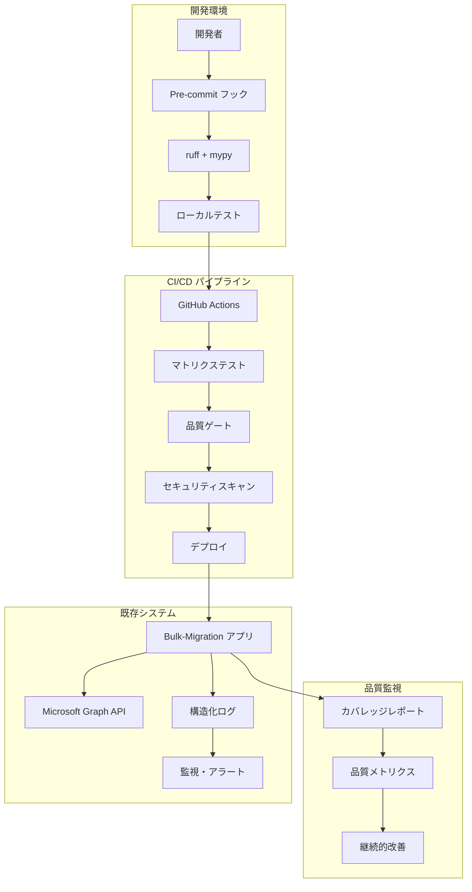

# 設計書

## 概要

本設計書は、実装済みの Bulk-Migration プロジェクトの品質向上を目的とした包括的な設計を定義します。現在の Prototype から Staging への移行期において、既存のアーキテクチャを維持しながら、段階的に品質向上を実現する設計アプローチを採用します。

## アーキテクチャ

### 全体アーキテクチャ



### 品質向上フェーズ設計

#### Phase 4: リンティング・コード品質
- **目的**: コード品質の標準化と自動化
- **アプローチ**: 既存コードへの段階的適用
- **成果物**: 設定ファイル、修正されたソースコード

#### Phase 5: テスト戦略・カバレッジ
- **目的**: テストカバレッジ 60% 達成と品質保証
- **アプローチ**: 既存テストの強化と新規テスト追加
- **成果物**: 拡張されたテストスイート、カバレッジレポート

#### Phase 6: CI/CD・自動化
- **目的**: 自動化された品質チェックとデプロイ
- **アプローチ**: GitHub Actions によるマルチプラットフォーム対応
- **成果物**: CI/CD パイプライン、品質ゲート

#### Phase 7-8: セキュリティ・監視
- **目的**: セキュリティ強化と運用監視
- **アプローチ**: 構造化ログと継続的セキュリティ監視
- **成果物**: セキュリティ設定、監視システム

## コンポーネントと インターフェース

### 1. コード品質管理コンポーネント

#### ruff 設定コンポーネント
```toml
# pyproject.toml 内の ruff 設定
[tool.ruff]
line-length = 88
target-version = "py313"
select = ["E", "F", "W", "I", "UP", "B", "C90", "T20"]
exclude = ["logs/", ".venv/", "build/"]

[tool.ruff.isort]
known-first-party = ["src"]
```

#### mypy 設定コンポーネント
```toml
# pyproject.toml 内の mypy 設定
[tool.mypy]
python_version = "3.13"
warn_unused_ignores = true
warn_redundant_casts = true
no_implicit_optional = true
# 段階的厳格化: staging で追加設定を有効化
```

### 2. テスト管理コンポーネント

#### pytest 設定コンポーネント
```toml
# pyproject.toml 内の pytest 設定
[tool.pytest.ini_options]
testpaths = ["tests"]
python_files = ["test_*.py"]
addopts = [
    "--cov=src",
    "--cov-report=html:htmlcov",
    "--cov-report=term-missing",
    "--cov-fail-under=60",  # staging 目標
    "-v"
]
markers = [
    "unit: 単体テスト",
    "integration: 統合テスト", 
    "auth: 認証関連テスト",
    "transfer: ファイル転送テスト",
    "config: 設定関連テスト"
]
```

#### モック戦略コンポーネント
```python
# tests/conftest.py での共通モック設定
@pytest.fixture
def mock_graph_client():
    """Microsoft Graph API クライアントのモック"""
    with patch('src.transfer.GraphTransferClient') as mock:
        # 標準的なレスポンスを設定
        mock.return_value.upload_file_to_sharepoint.return_value = {"id": "test"}
        yield mock

@pytest.fixture
def mock_auth():
    """認証コンポーネントのモック"""
    with patch('src.auth.GraphAuthenticator') as mock:
        mock.return_value.get_access_token.return_value = "mock_token"
        yield mock
```

### 3. CI/CD パイプラインコンポーネント

#### GitHub Actions ワークフロー設計
```yaml
# .github/workflows/quality-check.yml
name: 品質チェック
on: [push, pull_request]

jobs:
  quality-check:
    strategy:
      matrix:
        os: [ubuntu-latest, windows-latest, macos-latest]
        python-version: ["3.11", "3.12", "3.13"]
    
    steps:
      - uses: actions/checkout@v4
      - name: uv セットアップ
        uses: astral-sh/setup-uv@v1
      - name: 依存関係インストール
        run: uv sync
      - name: リンティング
        run: uv run ruff check .
      - name: 型チェック
        run: uv run mypy .
      - name: テスト実行
        run: uv run pytest
      - name: セキュリティスキャン
        uses: github/codeql-action/analyze@v2
```

### 4. セキュリティ管理コンポーネント

#### 秘密情報管理設計
```python
# src/config_manager.py の拡張
class SecureConfigManager(ConfigManager):
    """セキュリティ強化された設定管理"""
    
    def get_masked_config(self) -> Dict[str, Any]:
        """機密情報をマスクした設定を返す"""
        config = self.get_all_config()
        sensitive_keys = ['CLIENT_SECRET', 'TENANT_ID']
        
        for key in sensitive_keys:
            if key in config:
                config[key] = "***MASKED***"
        
        return config
```

#### ログマスキング設計
```python
# src/logger.py の拡張
import re
from typing import Dict, Any

class SecureLogger:
    """セキュリティ対応ログ出力"""
    
    SENSITIVE_PATTERNS = [
        r'client_secret=[\w-]+',
        r'access_token=[\w.-]+',
        r'tenant_id=[\w-]+',
    ]
    
    def mask_sensitive_data(self, message: str) -> str:
        """機密情報をマスクする"""
        for pattern in self.SENSITIVE_PATTERNS:
            message = re.sub(pattern, '[MASKED]', message, flags=re.IGNORECASE)
        return message
```

### 5. 監視・メトリクス コンポーネント

#### 構造化ログ設計
```python
# src/structured_logger.py
import json
import logging
from datetime import datetime
from typing import Dict, Any, Optional

class StructuredLogger:
    """構造化ログ出力クラス"""
    
    def __init__(self, name: str):
        self.logger = logging.getLogger(name)
        self.setup_json_formatter()
    
    def log_transfer_event(self, 
                          event: str, 
                          file_info: Dict[str, Any],
                          trace_id: Optional[str] = None,
                          **kwargs) -> None:
        """転送イベントの構造化ログ出力"""
        log_data = {
            "timestamp": datetime.utcnow().isoformat() + "Z",
            "level": "INFO",
            "event": event,
            "message": f"File transfer {event}",
            "logger": self.logger.name,
            "module": "transfer",
            "trace_id": trace_id or self.generate_trace_id(),
            "file_name": file_info.get("name"),
            "file_size": file_info.get("size"),
            "file_path": file_info.get("path"),
            **kwargs
        }
        
        # 機密情報のマスキング
        log_data = self.mask_sensitive_data(log_data)
        
        self.logger.info(json.dumps(log_data, ensure_ascii=False))
```

## データモデル

### 品質メトリクス データモデル
```python
from dataclasses import dataclass
from datetime import datetime
from typing import Dict, List, Optional

@dataclass
class QualityMetrics:
    """品質メトリクス データクラス"""
    timestamp: datetime
    coverage_percentage: float
    lint_errors: int
    type_errors: int
    security_vulnerabilities: int
    test_count: int
    failed_tests: int
    
    def to_dict(self) -> Dict[str, Any]:
        return {
            "timestamp": self.timestamp.isoformat(),
            "coverage": self.coverage_percentage,
            "lint_errors": self.lint_errors,
            "type_errors": self.type_errors,
            "security_issues": self.security_vulnerabilities,
            "tests": {
                "total": self.test_count,
                "failed": self.failed_tests,
                "success_rate": (self.test_count - self.failed_tests) / self.test_count if self.test_count > 0 else 0
            }
        }

@dataclass
class PhaseProgress:
    """フェーズ進捗 データクラス"""
    phase_name: str
    completion_percentage: float
    completed_tasks: List[str]
    remaining_tasks: List[str]
    target_completion_date: datetime
    actual_completion_date: Optional[datetime] = None
```

### 設定管理 データモデル
```python
@dataclass
class QualityConfig:
    """品質設定 データクラス"""
    coverage_threshold: float = 60.0  # staging 目標
    max_lint_errors: int = 0
    max_type_errors: int = 0
    max_security_vulnerabilities: int = 0
    
    # 段階的厳格化設定
    prototype_config: Dict[str, Any] = None
    staging_config: Dict[str, Any] = None
    production_config: Dict[str, Any] = None
    
    def get_config_for_phase(self, phase: str) -> Dict[str, Any]:
        """フェーズに応じた設定を取得"""
        configs = {
            "prototype": self.prototype_config or {},
            "staging": self.staging_config or {"coverage_threshold": 60.0},
            "production": self.production_config or {"coverage_threshold": 80.0}
        }
        return configs.get(phase, {})
```

## エラーハンドリング

### 品質チェック エラーハンドリング
```python
class QualityCheckError(Exception):
    """品質チェック関連エラー"""
    pass

class CoverageThresholdError(QualityCheckError):
    """カバレッジ閾値未達エラー"""
    def __init__(self, actual: float, threshold: float):
        self.actual = actual
        self.threshold = threshold
        super().__init__(f"カバレッジ {actual}% が閾値 {threshold}% を下回りました")

class SecurityVulnerabilityError(QualityCheckError):
    """セキュリティ脆弱性検出エラー"""
    def __init__(self, vulnerabilities: List[Dict[str, Any]]):
        self.vulnerabilities = vulnerabilities
        super().__init__(f"{len(vulnerabilities)} 件のセキュリティ脆弱性が検出されました")
```

### 段階的導入 エラーハンドリング
```python
class PhaseTransitionError(Exception):
    """フェーズ移行エラー"""
    def __init__(self, current_phase: str, target_phase: str, missing_requirements: List[str]):
        self.current_phase = current_phase
        self.target_phase = target_phase
        self.missing_requirements = missing_requirements
        super().__init__(
            f"{current_phase} から {target_phase} への移行に必要な要件が未完了: "
            f"{', '.join(missing_requirements)}"
        )
```

## テスト戦略

### テスト階層設計
1. **単体テスト (Unit Tests)**
   - 各モジュールの個別機能テスト
   - モック使用による外部依存排除
   - 高速実行、高頻度実行

2. **統合テスト (Integration Tests)**
   - モジュール間の連携テスト
   - 設定管理とログ出力の統合
   - 実際のファイル操作（小規模）

3. **契約テスト (Contract Tests)**
   - Microsoft Graph API との契約検証
   - API レスポンス形式の検証
   - エラーレスポンスの処理確認

### Microsoft Graph API テスト戦略
```python
# tests/test_graph_api_contract.py
class TestGraphAPIContract:
    """Microsoft Graph API 契約テスト"""
    
    @pytest.mark.integration
    def test_file_upload_contract(self, mock_graph_response):
        """ファイルアップロード API の契約テスト"""
        # 期待されるレスポンス形式を検証
        expected_fields = ["id", "name", "size", "lastModifiedDateTime"]
        
        for field in expected_fields:
            assert field in mock_graph_response
    
    @pytest.mark.integration  
    def test_error_response_handling(self, mock_error_response):
        """エラーレスポンスの処理テスト"""
        with pytest.raises(GraphAPIError) as exc_info:
            # エラーレスポンスの処理を検証
            pass
        
        assert "適切なエラーメッセージ" in str(exc_info.value)
```

### カバレッジ向上戦略
1. **未カバー行の特定**: `pytest --cov-report=term-missing` による詳細レポート
2. **優先順位付け**: 重要度の高いモジュールから順次対応
3. **段階的改善**: 現在 → 60% (staging) → 80% (production)

## 実装計画

### Week 1-2: 基盤整備
1. **設定ファイル作成**
   - `pyproject.toml` に ruff/mypy 設定追加
   - `.pre-commit-config.yaml` 作成
   - `Makefile` 作成

2. **既存コード修正**
   - `src/` 内の print 文を logging に置換
   - 基本的な型ヒント追加
   - import 順序統一

### Week 3-4: テスト強化
1. **テストカバレッジ測定**
   - 現在のカバレッジ状況把握
   - 未カバー行の特定と優先順位付け

2. **テスト追加・強化**
   - 重要モジュールのテスト追加
   - エラーハンドリングテスト強化
   - モック戦略の実装

### Week 5-6: CI/CD 導入
1. **GitHub Actions 設定**
   - 基本ワークフロー作成
   - マトリクステスト設定
   - 品質ゲート設定

2. **セキュリティ設定**
   - CodeQL 設定
   - 秘密情報スキャン設定
   - 依存関係脆弱性チェック

### Week 7-8: セキュリティ・監視
1. **構造化ログ導入**
   - JSON 形式ログ出力
   - 機密情報マスキング
   - トレース ID 対応

2. **継続的改善設定**
   - 品質メトリクス収集
   - 定期レビュー設定
   - アラート設定

## 成功指標

### Phase 4 完了条件
- `uv run ruff check .` でエラー 0
- `uv run mypy .` でエラー 0
- 全 print 文の logging 置換完了

### Phase 5 完了条件  
- テストカバレッジ 60% 以上達成
- 全テストケースにコメント・目的明記
- CI/CD でのカバレッジゲート設定完了

### Phase 6 完了条件
- GitHub Actions 全チェック通過
- セキュリティスキャンで脆弱性 0
- 自動化されたリリースプロセス構築

### Phase 7-8 完了条件
- 構造化ログ導入完了
- 秘密情報管理強化完了
- 監視・アラート設定完了